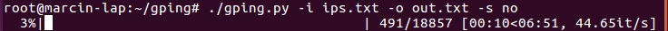

# Python Asynchronous (Async) ICMP Ping

Python asynchronous ICMP ping with progressbar

## Description

Python asynchronous ICMP ping with progressbar. Cut the ping time with asynchroneous opertions (ca. 40 pings per second)



## Dependencies


1) * [gevent](http://www.gevent.org/)

or

pip install gevent

2) * [tqdm]

or

pip install tqdm

3) Other standard modules (import clause)


## Installation

Everything is in the repo , so just drop the files to where you want to use it.

## Usage

```
usage: gping.py [-h] -i INPUT -o OUTPUT -s SHUFFLE

GPing Scanner v0.99

optional arguments:
  -h, --help            show this help message and exit
  -i INPUT, --input INPUT
                        Input list of IPs
  -o OUTPUT, --output OUTPUT
                        Output
  -s SHUFFLE, --shuffle SHUFFLE
                        Shuffle

```

## Website

Repository is at: https://gitlab.com/marcinguy/gping

## Author, Copyright and License

(C) 2016 Marcin Kozlowski <marcinguy@gmail.com>

pscanner is licensed under the terms of the MIT License.

Permission is hereby granted, free of charge, to any person obtaining a copy of
this software and associated documentation files (the "Software"), to deal in
the Software without restriction, including without limitation the rights to
use, copy, modify, merge, publish, distribute, sublicense, and/or sell copies
of the Software, and to permit persons to whom the Software is furnished to do
so, subject to the following conditions:

The above copyright notice and this permission notice shall be included in all
copies or substantial portions of the Software.

THE SOFTWARE IS PROVIDED "AS IS", WITHOUT WARRANTY OF ANY KIND, EXPRESS OR
IMPLIED, INCLUDING BUT NOT LIMITED TO THE WARRANTIES OF MERCHANTABILITY,
FITNESS FOR A PARTICULAR PURPOSE AND NONINFRINGEMENT. IN NO EVENT SHALL THE
AUTHORS OR COPYRIGHT HOLDERS BE LIABLE FOR ANY CLAIM, DAMAGES OR OTHER
LIABILITY, WHETHER IN AN ACTION OF CONTRACT, TORT OR OTHERWISE, ARISING FROM,
OUT OF OR IN CONNECTION WITH THE SOFTWARE OR THE USE OR OTHER DEALINGS IN THE
SOFTWARE.

